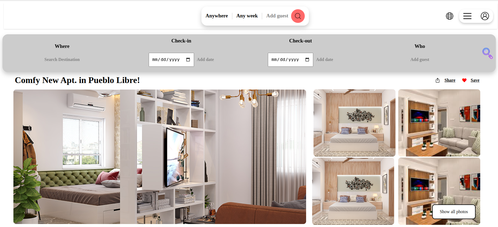
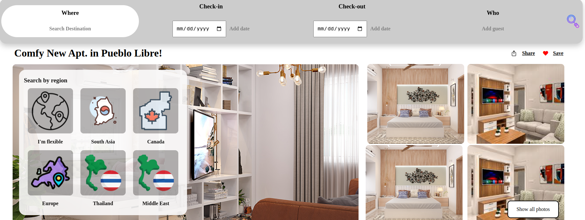
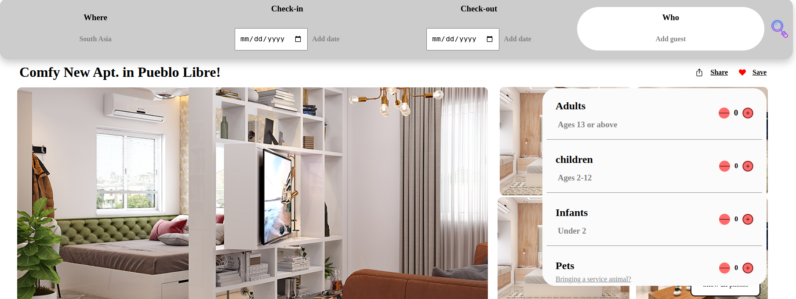
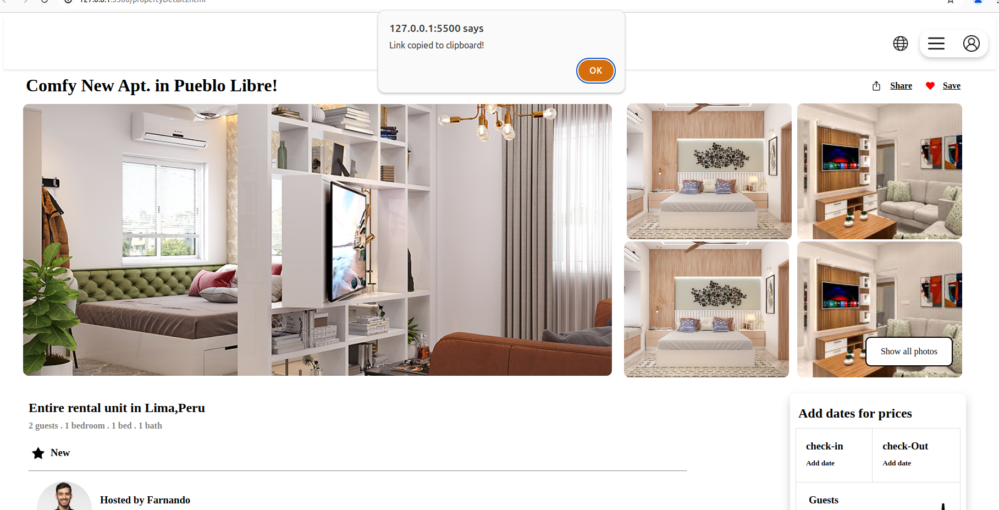
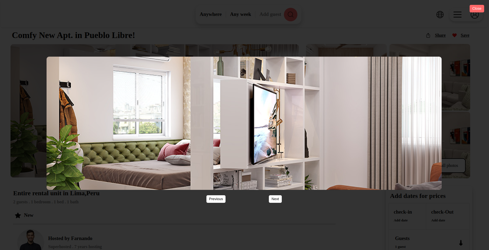
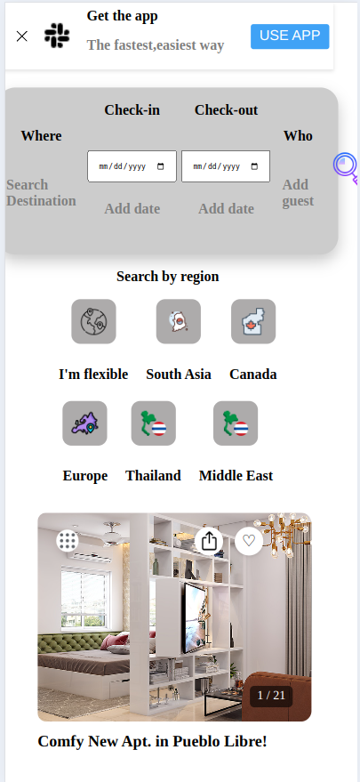
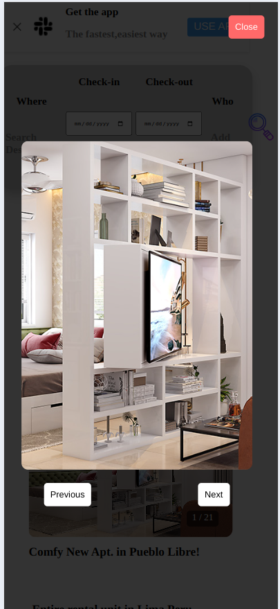

# Property Details Website

Welcome to the Property Details Website repository! This project showcases property details, features, rules, and safety information for residential flats. The website is built with HTML and CSS and JavaScript, ensuring responsiveness across various devices, including mobile phones.

## Features

- **Property Details:** Display detailed information about each flat, including amenities, location, and pricing.
- **Super Host & Co-Host:** Highlight super host and co-host information for enhanced credibility.
- **Features & Rules:** List the features offered by each property and specify rules for guests' safety and comfort.
- **JavaScript Functionality:** Our latest update introduces enhanced JavaScript functionality, allowing users to enjoy a more dynamic experience on our website. Users can now effortlessly add their destination, check-in date, check-out date, and guest number. This information can be conveniently saved into localStorage for future use. Additionally, users can view and navigate through pictures of the flat, providing a comprehensive and engaging browsing experience.

## Getting Started

To run the website locally or contribute to the project, follow these steps:

### Prerequisites

- Web browser (Chrome, Firefox, Safari, etc.)

### Clone the Repository

```bash
- https://github.com/w3-software-intern-Riad/dynamic-property-web.git
- cd property-details-website 
```

### How to open the website

- Open `propertyDetails.html` in your preferred web browser.
- Explore different property listings, features, and safety guidelines.

## Contributing
Contributions are welcome! Here's how you can contribute:

### Fork the Repository
```bash
- https://github.com/w3-software-intern-Riad/dynamic-property-web.git
- cd property-details-website
```
### Create a New Branch

```bash
git checkout -b feature/add-new-feature
```
### Make Modifications and Commit Changes
```bash
git commit -am 'Add new feature'
```
### Push Changes to the Branch

```bash
git push origin feature/add-new-feature
```
### Create a New Pull Request
- Navigate to the repository on GitHub.
- Click on the "Compare & pull request" button.
- Fill in the pull request details and submit it for review.

# Screen Shorts
- Desktop View

 
 





- Mobile View 


